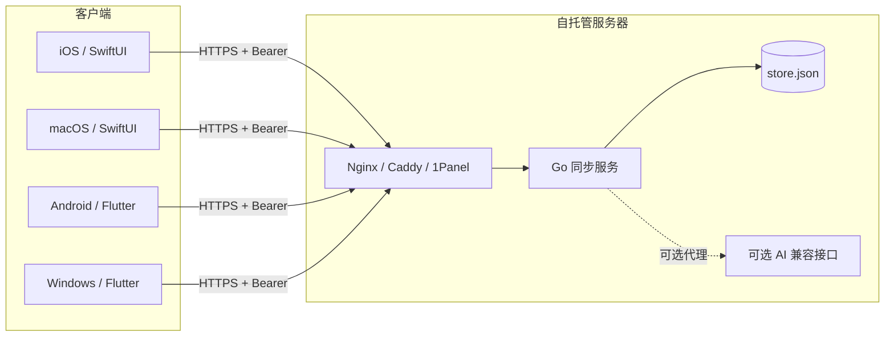
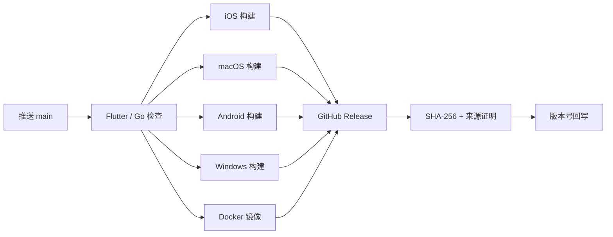

# 清序系统架构

清序采用“两套客户端实现、一份同步协议、一个轻量服务端”的结构。Apple 平台使用 SwiftUI，Android 与 Windows 使用 Flutter；所有客户端共享 Go 服务端的 JSON 协议。

返回：[项目首页](../README.md) · [产品范围](PRODUCT.md) · [设计规范](DESIGN.md) · [同步协议](SYNC_PROTOCOL.md)

## 系统全景

## 客户端

| 平台 | 目录 | UI 技术 | 本地状态管理 | 安全存储 |
| --- | --- | --- | --- | --- |
| iOS | `apps/apple` | SwiftUI、WidgetKit、ActivityKit | `AppStore` | Keychain |
| macOS | `apps/apple` | SwiftUI | `AppStore` | Keychain |
| Android | `apps/flutter` | Flutter | `TaskController` | `flutter_secure_storage` |
| Windows | `apps/flutter` | Flutter、托盘与窗口插件 | `TaskController` | `flutter_secure_storage` |

任务数据使用平台应用数据目录中的 JSON 文件。主题、模块顺序等设备偏好留在本机；任务、番茄钟和 RSS 阅读状态进入同步文档。

### Apple 系统扩展

iOS 主应用与 `QingxuWidgets` 扩展通过 `group.one.darker.qingxu` App Group 共享最小快照：

- WidgetKit 读取今日任务和专注状态。
- ActivityKit 显示锁屏实时活动与灵动岛。
- 运行中的倒计时保存绝对结束时间，不依赖应用在后台每秒执行。
- 扩展不直接访问同步网络；状态由主应用写入共享容器。

## 本地优先写入

客户端修改数据时遵循同一顺序：

1. 更新内存状态。
2. 使用临时文件与原子替换写入本机。
3. 刷新界面和系统扩展快照。
4. 普通编辑经过约 100 毫秒合并窗口后同步；番茄钟关键操作立即同步。
5. 网络失败保留本地修改，恢复联网后重新合并。

因此同步服务不可用时，创建、完成和调整任务仍然可以正常工作。

## 同步模型

- **任务**：以 `id` 为永久身份，按 `updatedAt` 进行 last-write-wins 合并；相同时间下删除墓碑优先。
- **番茄钟**：一个单例 LWW 文档；运行状态使用绝对 UTC `endsAt`，`phaseID` 区分连续阶段，`dailyFocusGoal` 与 `focusHistory` 支撑多端目标和热力图，响应中的 `serverTime` 用于修正设备时钟偏差。
- **RSS**：一个单例 LWW 文档，保存订阅、分类与文章阅读状态；正文只在本机缓存。
- **实时通知**：前台客户端通过 `/v1/changes` 等待修订号变化，变化后再调用 `/v1/sync`。
- **容错**：5 分钟完整同步用于重连兜底，不替代变更通知。
- **恢复**：客户端持久化最近修订号；进程重启后从该位置继续等待，断线使用带抖动的指数退避。

当前模型是文档级 LWW，不是逐字段 CRDT。两个设备同时修改同一任务时，时间更新的完整任务获胜。

## 同步服务

`services/sync` 是仅依赖 Go 标准库的单进程 HTTP 服务：

- `GET /health`：检查进程与数据目录可写性。
- `GET /v1/ping`：验证 Bearer 密钥。
- `POST /v1/sync`：原子合并并返回完整同步状态。
- `GET /v1/changes`：最长等待 25 秒的低成本变更通知。
- `POST /v1/ai`：可选的 RSS 摘要、翻译和任务规划代理。

持久化采用临时文件、`fsync` 和原子替换，默认写入 `/data/store.json`。服务定位为单用户、单实例，不能让多个进程同时写同一个文件。

Docker 默认以非 root 用户运行，根文件系统只读，移除 Linux capabilities，限制进程数和 64 MiB 内存；公网 TLS 由 Nginx、Caddy 或 1Panel OpenResty 提供。

## AI 调用路径

客户端支持两种模式：

1. **自托管代理**：客户端使用同步地址与同步密钥调用 `/v1/ai`，模型密钥只存在服务器 `.env`。
2. **客户端直连**：iOS/macOS 直接调用 OpenAI、DeepSeek 或兼容 Chat Completions 接口，API Key 写入 Keychain。

服务端和客户端都提供内置默认提示词；用户只需选择连接方式、填写必要凭据并测试连接。AI 失败不会影响任务、本地 RSS 或同步功能。

## 发布架构

公开工作流生成未签名 iOS IPA。包含个人证书的签名构建由独立的 `Private Signed iOS` 手动工作流完成，产物加密且不进入公开 Release。

产品预览站独立维护，不参与本仓库构建和同步数据流。
